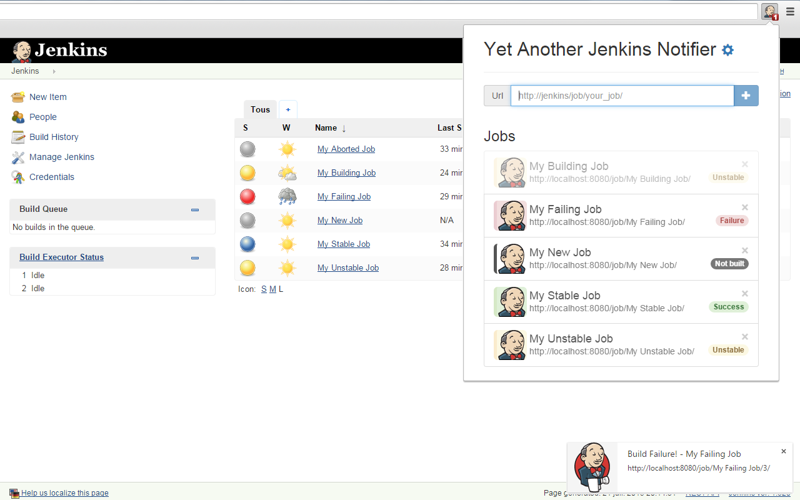
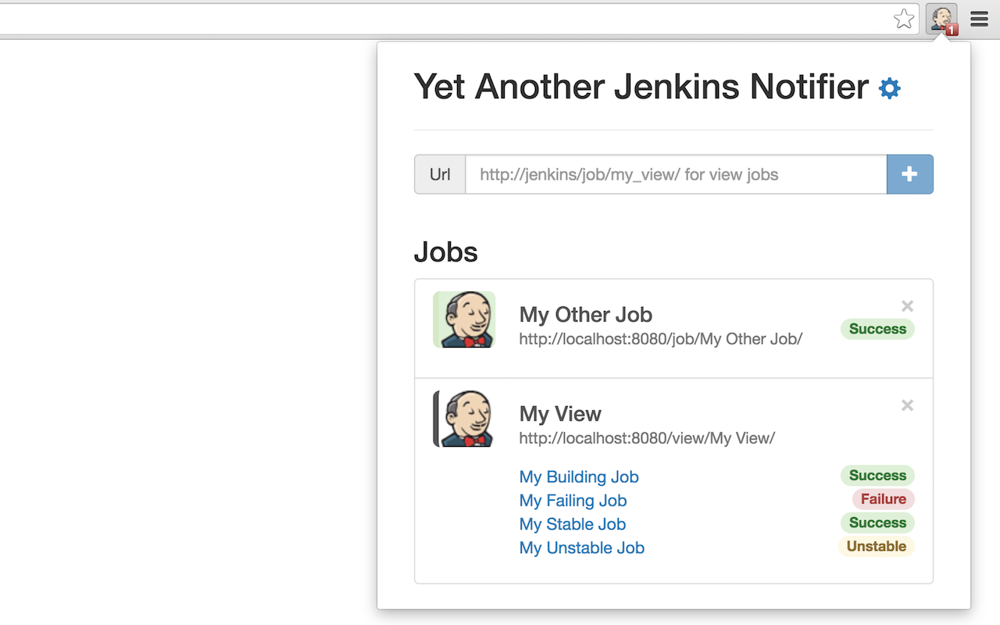
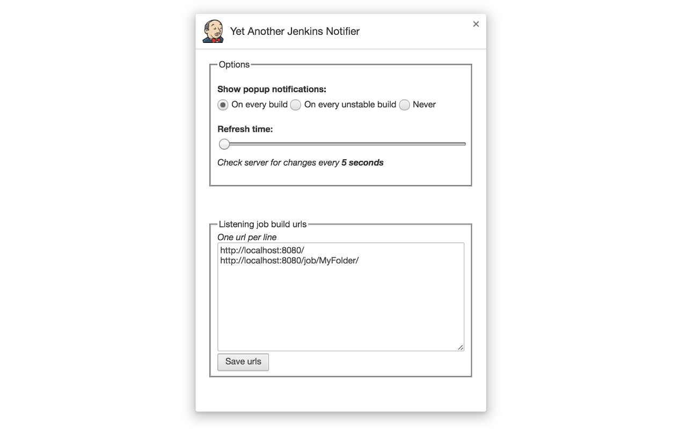

  Yet Another Jenkins Notifier
------------------

This extension monitors Jenkins jobs and notifies you of build results with desktop notifications.

Features:  
✔ Pop-up notifications  
✔ Single job, view jobs or all jobs monitoring  
✔ Folder and Pipeline support  
✔ Multiple Jenkins servers support  
✔ Number of failing, unstable or stable jobs in icon badge  
✔ Choose to be notified on every build or on every unstable build

# Installation

# Screenshots

_____________

_____________

# Author

This extension was created by Guillaume Girou ([Google+](https://plus.google.com/+GuillaumeGirou), [Twitter](https://twitter.com/GirouGuillaume), [GitHub](https://github.com/ggirou)).

# Source

Source code available on [GitHub](https://github.com/ggirou/yet-another-jenkins-notifier).

# Bug tracker

Found a bug? Please submit an issue on [GitHub](https://github.com/ggirou/yet-another-jenkins-notifier/issues/new) or even better, submit a pull request :)

# Copyright and license

Copyright 2016 Yet Another Jenkins Notifier.
Released under [GNU General Public License v3.0](https://github.com/ggirou/yet-another-jenkins-notifier/blob/master/LICENSE).
